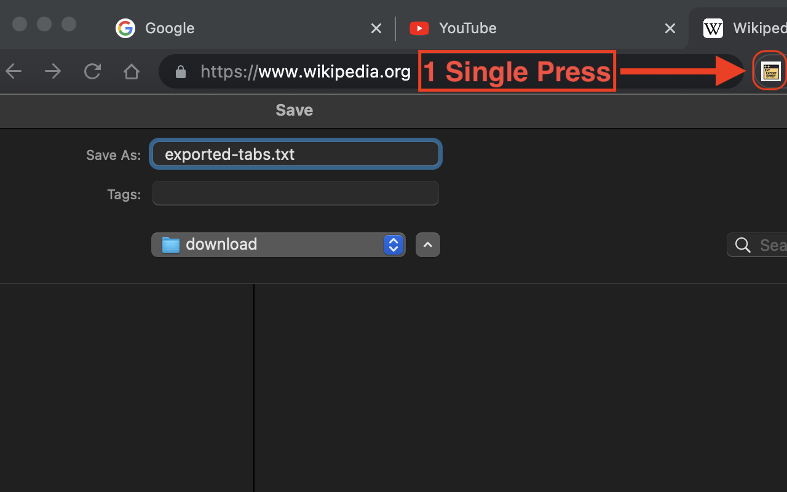
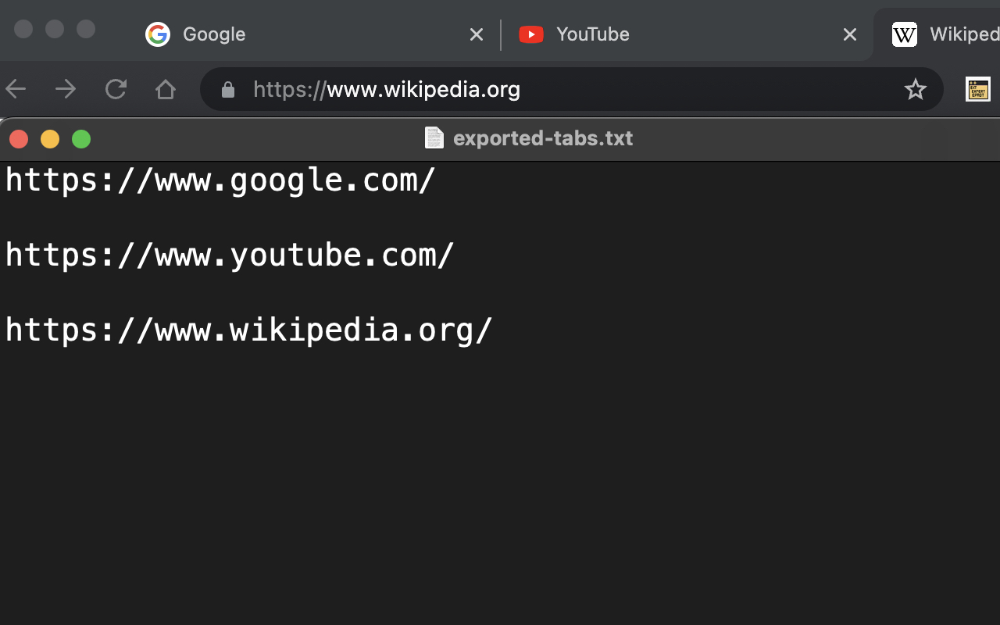

# Export Tabs: Google Chrome Extension

## Author: Keonhee Park (Gunhee Park).

The Google Chrome browser's extension was created by Keon Hee Park (Gunhee Park).
The source code was completed on Friday, June 2, 2023.

## Description

"Export Tabs" is a Google Chrome extension that provides users the convenience of exporting all open tabs in the current window to a `.txt` text file with a single click. It is a handy tool for saving your current browsing session for later reference, allowing for efficient organization and preservation of important web pages.

## How it works

The extension is simple to use. Once installed, it will appear as an icon on your Chrome toolbar. Clicking the icon will instantly download a text file ('exported-tabs.txt') that contains the URLs of all open tabs in the current window.

The downloaded text file contains the URLs of all the tabs in the window from which the extension was activated.

## Setup Instructions

To use this extension, follow the steps below:

1. Download or clone this repository to your local machine.
2. Open Google Chrome, then navigate to `chrome://extensions`.
3. Enable `Developer mode` by ticking the checkbox located in the upper-right corner.
4. Click on the `Load unpacked` button and select the downloaded folder containing the extension files.

## Permissions

The extension requires two permissions to operate:

- `tabs`: This permission is needed to access the URLs of all open tabs.
- `downloads`: This permission allows the extension to create and download the `.txt` file.

## Project Structure

The extension consists of the following files:

- `manifest.json`: The manifest file of the extension, containing metadata required by Chrome and the extension's configuration.
- `background.js`: The JavaScript file that contains the main functionality of the extension. It handles gathering the URLs and creating the downloadable text file.
- Icon files: The extension uses three icon files (`icon16x16.png`, `icon48x48.png`, `icon128x128.png`). These files provide the extension's icon at different resolutions.

## Future Work

While the extension is fully functional, future improvements may include options for formatting the exported list of URLs, integrating with cloud storage services for automatic backups, and more.

## License

This project is open source and freely available for public use. 

## Contact

For inquiries, suggestions, or discussions:

- LinkedIn: Gunhee Park (https://linkedin.com/in/parkkeonhee)
- GitHub: parkkeonhee (https://github.com/parkkeonhee)
